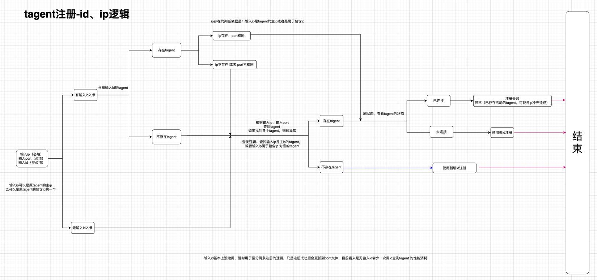

中文 / [English](README.en.md)

## tagent注册

### 1、配置
（1）tagent端配置：<br>
进入/opt/tagent/run/root/conf目录<br>
编辑tagent.conf文件<br>
必填参数说明：
|  必填参数  |  备注  |
|  --------  |  ----  |
|  credential  |  加密后的密码串  |
|  proxy.group  |  runner的ip地址和心跳端口  |
|  proxy.registeraddress  |  tagent在runner的注册地址，还需带上租户的uuid  |
|  tagent.id  |  tagent id  |
|  tenant  |  租户uuid  |

以安装在192.168.0.25的tagent、192.168.0.32的runner（服务端口为8084，心跳端口为8888）、192.168.0.25的neatlogic（租户为test）为例：
```
credential={ENCRYPTED}19chdeh34c738cb575fef816607
exec.timeout=900
listen.addr=0.0.0.0
listen.backlog=16
listen.port=3939
proxy.group=192.168.0.32:8888
proxy.group.id=
proxy.registeraddress=http://192.168.0.32:8084/autoexecrunner/public/api/rest/tagent/register?tenant=test
read.timeout=5
tagent.id=123
tenant=test
```

（2）neatlogic端配置<br>
在执行器组管理页面添加runner组，网段的范围必须包含tagent的ip地址。


### 2、启动tagent服务

**1、启动tagent服务命令**
```
service tagent start
/bin/systemctl start tagent.service
```
**2、停止tagent服务命令**
```
service tagent stop
/bin/systemctl stop tagent.service 
```

### 3、注册流程图


注：<br>
（1）在neatlogic注册时，先是判断tagent的ip在哪一个runner组的网段内，匹配到runner组，再使用组内的runner；<br>
（2）tagent注册到neatlogic后，tagent和runner之间的心跳正常就会更新tagent的信息到neatlogic。<br>
在neatlogic端一系列对tagent的操作，都会通过runner端执行tagent的命令
